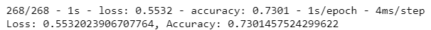

#### deep-learning-challenge

## Purpose
The purpose of this assignment is to use deep learning and neural networks to create a model that predicts whether a funding applicant for nonprofit foundation Alphabet Soup will be successful, based on 34,000 organisations that have received funding from Alphabet Soup over the years.

## Results

#### Data Processing
- Target variable: `IS_SUCCESSFUL`
- Feature variables: `APPLICATION_TYPE`, `AFFILIATION`, `CLASSIFICATION`, `USE_CASE`, `ORGANIZATION`, `STATUS`, `INCOME_AMT`, `SPECIAL_CONSIDERATIONS`, and `ASK_AMT`
- Removed variables: `EIN` and `NAME` columns

#### Compiling, Training, and Evaluating the Model
- Number of neurons, layers, and activation functions selected for the neural network model: 
The initial model had 2 hidden layers and an output layer, with 16, 16 and 1 neuron respectively. This model produced an accuracy score of 73.01%. The ReLu function was used for the activiation function in the hidden layers, and the Sigmoid activation function was used in the output layer as it was a binary classification model.

- Achieve target model performance of 75%? No - the model was ran several times throughout this assignment in an attempt to optimise the model and improve its accuracy score from the initial model. The final model achieved an accuracy score of 73.17%, however this is below the goal of 75%.
(Images/Final_model.png)
- Steps taken to increase model performance: Adjusting the bin parameters, adding an additional hidden layer and increasing the neurons helped in improving the model's perfomance, as well as making adjustments to the number of epochs when training the model. 

## Summary
The optimised model achieved an accuracy of 73.17%, however this did not meet the target of 75%. There were several attempts made at optimising the model through a number of adjustments which resulted in a marginal increase in the model's performance. 

An alternative to the model used is a Random Forests model which is less prone to the risk of overfitting. 
